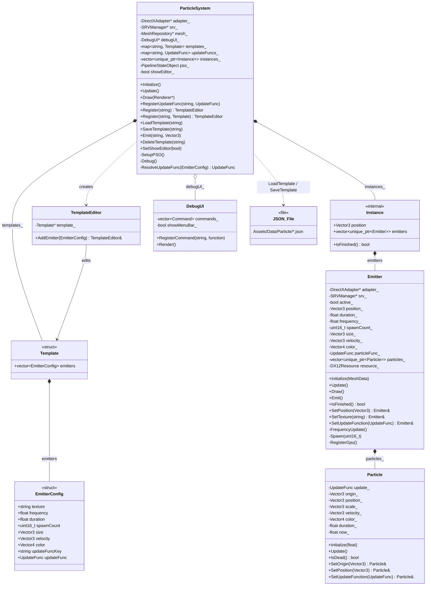
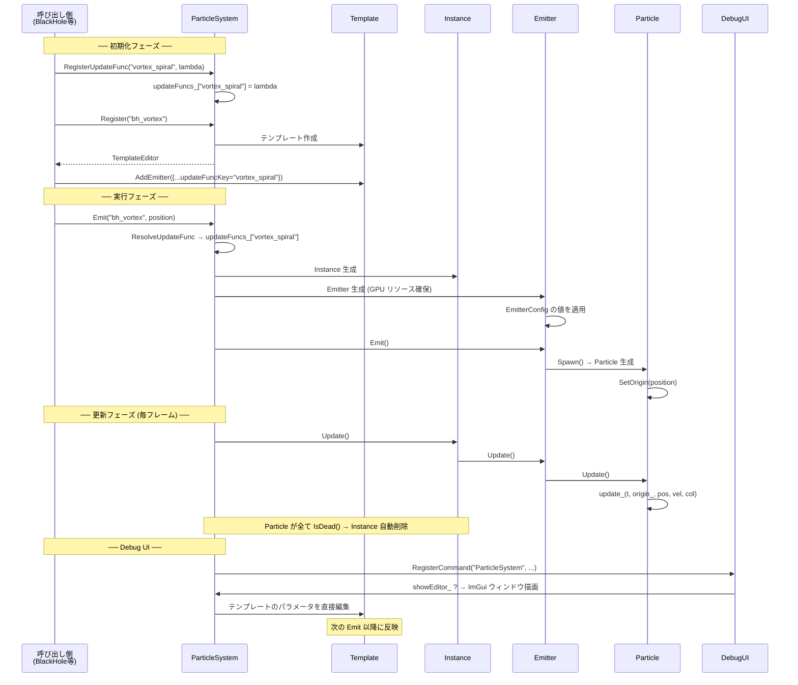

# ParticleSystem 設計ドキュメント — Template / Instance 分離

本ドキュメントは、ParticleSystem の「登録」と「発射」の責務分離、
JSON シリアライズ対応、UpdateFunc の文字列キー管理について設計と実装を説明する。

---

## 背景と課題

### 旧設計の問題点

旧設計では `Register()` が即座に GPU リソースを持つ Emitter を生成し、
`Group` として管理していた。

```
旧: Register("name") → Group（GPU リソース付き Emitter を保持）
    Edit("name").SetPosition(pos).Emit() → Group 内の Emitter から発射
    Delete("name") → 手動で Group を破棄
```

| 問題 | 詳細 |
|------|------|
| **登録 = 実体生成** | Register 時点で GPU リソースが確保され、テンプレートとして再利用できない |
| **JSON シリアライズ不可** | EmitterConfig に `std::function`（ラムダ）が混在しており、データとロジックが分離されていない |
| **手動ライフサイクル管理** | 呼び出し側が `Delete()` を呼ばないとリソースリークする |
| **動的コンテキスト依存** | ラムダが `this` をキャプチャするため、特定のインスタンスに束縛される |

---

## 新設計

### アーキテクチャ概要

```
ParticleSystem
  ├── templates_: map<string, Template>        ← データのみ。GPU リソースなし
  ├── updateFuncs_: map<string, UpdateFunc>    ← 文字列キーで登録された振る舞い
  └── instances_: vector<unique_ptr<Instance>> ← Emit 時に生成。自動破棄
```

#### 三つの構成要素

| 要素 | 役割 | ライフサイクル |
|------|------|----------------|
| **Template** | EmitterConfig の集合。パーティクルの「定義」 | ユーザーが明示的に登録・削除 |
| **UpdateFunc** | 文字列キーで管理される更新関数 | ユーザーが明示的に登録 |
| **Instance** | Emit 時に Template からコピーして生成される「実体」 | 全パーティクル消滅後に自動破棄 |

### データフロー

```
1. RegisterUpdateFunc("vortex_spiral", lambda)   ← 振る舞いを登録
2. Register("bh_vortex").AddEmitter({config})     ← テンプレートを登録
3. Emit("bh_vortex", position)                    ← テンプレートをコピーして Instance 生成
   ├── Template の EmitterConfig をコピー
   ├── updateFuncKey → updateFuncs_ から関数を解決
   ├── Emitter を生成（GPU リソース確保）
   ├── Emitter::Emit() でパーティクル発射
   └── Instance を instances_ に追加
4. Update()
   ├── 全 Instance の全 Emitter を更新
   └── 終了した Instance を自動削除（erase_if）
```

---

## 主要な型

### EmitterConfig

パーティクル Emitter の設定データ。JSON シリアライズ可能なフィールドと、
コード専用フィールドを持つ。

```cpp
struct EmitterConfig {
    std::string texture = "white_x16.png";
    float frequency = 0.f;        // 0 = ワンショット
    float duration = 1.f;
    uint16_t spawnCount = 1;
    Vector3 size = {1.f, 1.f, 1.f};
    Vector3 velocity = {0.f, 0.f, 0.f};
    Vector4 color = {1.f, 1.f, 1.f, 1.f};
    std::string updateFuncKey;     // JSON 用: 登録済み関数のキー
    UpdateFunc updateFunc;         // コード用: 直接ラムダ指定（JSON では無視）
};
```

### Template

EmitterConfig の集合。データのみを保持し、GPU リソースは持たない。

```cpp
struct Template {
    std::vector<EmitterConfig> emitters;
};
```

### Instance（内部構造体）

Emit 時に Template からコピーして生成される実体。
ユーザーはこの型に直接アクセスしない。

```cpp
struct Instance {
    Vector3 position;
    std::vector<std::unique_ptr<Emitter>> emitters;
    bool IsFinished() const;  // 全 Emitter が終了したら true
};
```

---

## UpdateFunc の設計

### UI EventSystem との対応

UI システムでは `EventSystem` が文字列キーとラムダのマッピングを管理する。
ParticleSystem の UpdateFunc 管理はこれと同じパターンを採用している。

```
UI:       RegisterAction("Pause.Resume", [this]() { Resume(); })
Particle: RegisterUpdateFunc("vortex_spiral", [](float t, ...) { ... })
```

### シグネチャ

```cpp
using UpdateFunc = std::function<void(
    float t,                 // 正規化された経過時間 (0.0 ~ 1.0)
    const Vector3& origin,   // Emit 時の位置（Emitter の原点）
    Vector3& position,       // パーティクルの現在位置
    Vector3& velocity,       // パーティクルの現在速度
    Vector4& color           // パーティクルの現在色
)>;
```

#### origin パラメータの導入理由

旧設計では BlackHole の渦巻きパーティクルで `this` をキャプチャして
BlackHole の `position_` を参照していた。

```cpp
// 旧: this キャプチャが必要 → 特定インスタンスに束縛される
.updateFunc = [this, radius](float t, const Vector3& position, Vector3& velocity, Vector4& color) {
    Vector3 toCenter = position_ - position;  // position_ = BlackHole::position_
    // ...
}
```

新設計では `origin`（Emit 時の位置）が引数として渡されるため、
キャプチャなしで同じ処理が書ける。

```cpp
// 新: キャプチャ不要 → どのインスタンスからでも再利用可能
particle_->RegisterUpdateFunc("vortex_spiral",
    [](float t, const Vector3& origin, Vector3& pos, Vector3& vel, Vector4& col) {
        Vector3 toCenter = origin - pos;  // origin = Emit 時に渡された位置
        // ...
    }
);
```

### 解決順序

EmitterConfig に `updateFunc`（直接ラムダ）と `updateFuncKey`（文字列キー）の
両方が指定できる。解決は以下の優先順位で行われる。

```
1. updateFunc が設定済み → そのまま使用
2. updateFuncKey が設定済み → updateFuncs_ マップから検索
3. どちらも未設定 → 更新関数なし（パーティクルは velocity のみで移動）
```

---

## パブリック API

### テンプレート操作

```cpp
// 空のテンプレートを登録し、TemplateEditor を返す
TemplateEditor Register(const std::string& _name);

// 既存の Template をコピーして登録
TemplateEditor Register(const std::string& _name, const Template& _template);

// JSON ファイルからテンプレートを読み込み
void LoadTemplate(const std::string& _name);  // Assets/Data/Particle/<name>.json

// テンプレートを JSON ファイルに保存
void SaveTemplate(const std::string& _name) const;

// テンプレートを削除
void DeleteTemplate(const std::string& _name);
```

### UpdateFunc 操作

```cpp
// 更新関数を文字列キーで登録
void RegisterUpdateFunc(const std::string& _key, UpdateFunc _func);
```

### 発射

```cpp
// テンプレートをコピーして Instance を生成し、パーティクルを発射
void Emit(const std::string& _templateName, const Vector3& _position);
```

### TemplateEditor（フルエント API）

```cpp
class TemplateEditor {
public:
    TemplateEditor& AddEmitter(const EmitterConfig& _config);
};
```

---

## JSON フォーマット

パス: `Assets/Data/Particle/<name>.json`

```json
{
    "Emitters": [
        {
            "Texture": "white_x16.png",
            "Frequency": 0.0,
            "Duration": 1.2,
            "SpawnCount": 5,
            "Size": [0.15, 0.15, 0.15],
            "Velocity": [0.0, 0.0, 0.0],
            "Color": [0.4, 0.1, 1.0, 0.8],
            "UpdateFunc": "vortex_spiral"
        }
    ]
}
```

| フィールド | 型 | 説明 |
|------------|------|------|
| Texture | string | テクスチャファイル名 |
| Frequency | float | スポーン間隔（秒）。0 でワンショット |
| Duration | float | パーティクルの寿命（秒） |
| SpawnCount | int | 1回のスポーンで生成するパーティクル数 |
| Size | float[3] | パーティクルのスケール (x, y, z) |
| Velocity | float[3] | 初速 (x, y, z) |
| Color | float[4] | 色 (r, g, b, a) |
| UpdateFunc | string | 登録済み UpdateFunc のキー名（省略可） |

`UpdateFunc` は `RegisterUpdateFunc()` で事前に登録されたキーを指定する。
未登録のキーが指定された場合、更新関数なしとして扱われる。

---

## 使用例

### 基本的なヒットエフェクト

```cpp
// 初期化時: UpdateFunc とテンプレートを登録
particle_->RegisterUpdateFunc("hit_explosion",
    [](float t, const Vector3&, Vector3& pos, Vector3& vel, Vector4& col) {
        (void)pos;
        if (t < 0.01f) {
            vel = Vector3::Random() * 8.0f;
        }
        vel = vel * 0.92f;
        vel.y -= 0.05f;
        col.w = 0.9f * (0.7f - t);
    }
);

particle_->Register("hit")
    .AddEmitter({
        .texture = "white_x16.png",
        .duration = 0.7f,
        .spawnCount = 15,
        .size = {0.3f, 0.3f, 0.3f},
        .color = {0.f, 0.2f, 1.f, 0.9f},
        .updateFuncKey = "hit_explosion",
    });

// 発射時: 位置を指定するだけ
Vector3 hitPosition = {3.f, 2.f, 0.f};
particle_->Emit("hit", hitPosition);
// → Instance が自動生成され、パーティクル消滅後に自動破棄
```

### origin を活用した渦巻きエフェクト

```cpp
// 初期化時
particle_->RegisterUpdateFunc("vortex_spiral",
    [](float t, const Vector3& origin, Vector3& pos, Vector3& vel, Vector4& col) {
        (void)pos;
        Vector3 toCenter = origin - pos;
        toCenter.y = 0.f;
        float dist = toCenter.Length();
        if (dist > 0.1f) {
            Vector3 inward = toCenter.Normalize();
            Vector3 tangent = {-inward.z, 0.f, inward.x};
            float speed = 2.f + dist * 0.5f;
            vel.x = (inward.x * 0.6f + tangent.x) * speed;
            vel.z = (inward.z * 0.6f + tangent.z) * speed;
        } else {
            vel.x = 0.f;
            vel.z = 0.f;
        }
        vel.y *= 0.9f;
        col.x = 0.4f * (1.f - t);
        col.z = 1.f;
        col.w = 0.8f * (1.f - t * t);
    }
);

particle_->Register("bh_vortex")
    .AddEmitter({
        .texture = "white_x16.png",
        .duration = 1.2f,
        .spawnCount = 5,
        .size = {0.15f, 0.15f, 0.15f},
        .color = {0.4f, 0.1f, 1.f, 0.8f},
        .updateFuncKey = "vortex_spiral",
    });

// 発射時: origin として位置が渡される
// 繰り返し呼ぶと毎回新しい Instance が生成される
particle_->Emit("bh_vortex", currentPosition);
```

### JSON からテンプレートを読み込む場合

```cpp
// UpdateFunc は事前にコードで登録しておく
particle_->RegisterUpdateFunc("vortex_spiral", /* lambda */);

// テンプレートのデータ部分は JSON から読み込み
particle_->LoadTemplate("BlackHole");  // Assets/Data/Particle/BlackHole.json

// 発射
particle_->Emit("BlackHole", position);
```

---

## Debug UI

### 概要

`showEditor_` フラグで表示を切り替えるパーティクルエディタウィンドウ。
`DebugUI::RegisterCommand` を通じて ImGui ウィンドウとして描画される。

### 機能

| 機能 | 説明 |
|------|------|
| テンプレート一覧 | 登録済みテンプレートを CollapsingHeader で表示 |
| パラメータ編集 | Frequency, Duration, SpawnCount, Size, Velocity, Color を ImGui で編集 |
| UpdateFuncKey 表示 | 紐付けられた UpdateFunc のキー名を表示（読み取り専用） |
| Save ボタン | 現在のパラメータ値を JSON に保存 |
| Test Emit ボタン | テスト位置 (0, 1, 0) にパーティクルを発射 |
| Active Instances 表示 | 現在生存中の Instance 数を表示 |

### メニューバーとの連携

現在は `showEditor_` を直接操作する `SetShowEditor()` メソッドを提供している。
将来メニューバーに統合する場合は、以下のように 1 行追加するだけで対応可能。

```cpp
// DebugUI のメインメニューバー内に追加する想定
if (ImGui::BeginMenu("Windows")) {
    ImGui::MenuItem("Particle Editor", nullptr, &particleSystem->showEditor_);
    ImGui::EndMenu();
}
```

### 設計方針

- エディタウィンドウはデフォルトで非表示（`showEditor_ = false`）
- ImGui の `Begin("Particle Editor", &showEditor_)` で閉じるボタンを提供
- DebugUI の RegisterCommand は毎フレーム呼ばれるが、
  `showEditor_` が false の場合は即 return してコストを最小化

---

## 旧 API からの移行ガイド

### Register

```cpp
// 旧
particle_->Register("name", position)
    .AddEmitter({.active = false, .updateFunc = [this](...){...}, ...});

// 新
particle_->RegisterUpdateFunc("func_key", [](float t, const Vector3& origin, ...){...});
particle_->Register("name")
    .AddEmitter({.updateFuncKey = "func_key", ...});
```

**変更点:**
- `Register` の第2引数 `position` を削除（位置は Emit 時に指定）
- `EmitterConfig::active` を削除（Instance は生成時にアクティブ）
- `EmitterConfig::updateFunc` → `updateFuncKey` に移行（JSON 化のため）
- UpdateFunc のシグネチャに `const Vector3& origin` を追加

### Emit

```cpp
// 旧
particle_->Edit("name").SetPosition(pos).Emit();

// 新
particle_->Emit("name", pos);
```

**変更点:**
- `Edit()` を廃止。位置は `Emit` の引数で渡す
- 毎回新しい Instance が生成され、自動破棄される

### Delete

```cpp
// 旧
particle_->Delete("name");  // Group を手動削除

// 新: Instance は自動破棄されるため不要
// テンプレート定義自体を消す場合のみ:
particle_->DeleteTemplate("name");
```

### Enable

```cpp
// 旧
particle_->Enable("name");

// 新: 廃止。Emit を呼べば即座にアクティブな Instance が生成される
```

---

## 変更対象ファイル一覧

### Engine

| ファイル | 変更概要 |
|----------|----------|
| `src/ParticleSystem/ParticleSystem.hpp` | Group/GroupEditor → Template/TemplateEditor/Instance に再設計 |
| `src/ParticleSystem/ParticleSystem.cpp` | テンプレート管理、Instance 生成・自動破棄、JSON I/O、Debug UI |
| `src/ParticleSystem/Emitter/Emitter.hpp` | `IsFinished()` 追加、UpdateFunc シグネチャ変更 |
| `src/ParticleSystem/Emitter/Emitter.cpp` | `IsFinished()` 実装、`Spawn()` で origin 設定 |
| `src/ParticleSystem/Particle/Particle.hpp` | `origin_` メンバ追加、`SetOrigin()` 追加、UpdateFunc シグネチャ変更 |
| `src/ParticleSystem/Particle/Particle.cpp` | `Update()` で origin を渡す、`SetOrigin()` 実装 |

### Game

| ファイル | 変更概要 |
|----------|----------|
| `Skill/BlackHole/BlackHole.cpp` | RegisterUpdateFunc + Register + Emit パターンに移行。this キャプチャ廃止 |
| `Player/Player.cpp` | 同上 |
| `Enemy/Enemies.cpp` | 同上 |
| `Enemy/Enemy.cpp` | `Edit().SetPosition().Emit()` → `Emit(name, pos)` |

### 新規

| パス | 内容 |
|------|------|
| `Assets/Data/Particle/` | JSON テンプレートファイル格納ディレクトリ |

---

## ImGui Editor の位置付け

### 現状の構造

ImGui Editor は ParticleSystem の `Debug()` メソッド内に実装されており、
`DebugUI::RegisterCommand` を通じて毎フレーム登録される。

```
Framework::Update()
  └── ParticleSystem::Update()
        └── Debug()
              └── DebugUI::RegisterCommand("ParticleSystem", lambda)

Framework::Draw()
  └── DebugUI::Render()
        └── Process()
              └── 登録済みコマンドを ID 順に実行
                    └── "ParticleSystem" コマンド実行
                          ├── showEditor_ == false → 即 return
                          └── showEditor_ == true  → ImGui ウィンドウ描画
```

### Editor が操作するもの

Editor は **Template（テンプレートデータ）を直接編集** する。
Instance（実体）には一切触れない。

```
Editor が操作する対象:
  templates_["bh_vortex"].emitters[0].duration  ← ImGui::DragFloat で変更
  templates_["bh_vortex"].emitters[0].color     ← ImGui::ColorEdit4 で変更

Editor が操作しない対象:
  instances_[n]  ← 内部管理。ユーザーにもEditorにも非公開
```

この設計により、Editor でテンプレートのパラメータを変更すると、
**次の Emit 以降** に生成される Instance に反映される。
既に生存中の Instance には影響しない（コピー済みのため）。

### 表示制御の仕組み

`showEditor_` フラグが唯一の制御点であり、以下の 3 つの経路から操作できる。

| 経路 | 方法 | 現在の状態 |
|------|------|------------|
| コードから | `SetShowEditor(true)` | 実装済み |
| ImGui ウィンドウの x ボタン | `ImGui::Begin("...", &showEditor_)` | 実装済み |
| メニューバーから | `ImGui::MenuItem("...", nullptr, &showEditor_)` | 未実装（将来対応） |

メニューバーへの統合は DebugUI 側の拡張であり、
ParticleSystem 側は `showEditor_` を公開するだけで対応が完了する。
つまり ParticleSystem の Editor 実装はメニューバー統合を **前提として設計されている** が、
それ自体への依存はない。

---

## クラス図



**補足:**
- `Register()` は Template（データ定義）を登録する
- `Emit()` は Template をコピーして Instance を生成する
- Instance は全 Particle 消滅後に自動破棄される（ユーザーからは不可視）
- `showEditor_` フラグで Editor ウィンドウの表示を制御する

### 登録から発射までのシーケンス


