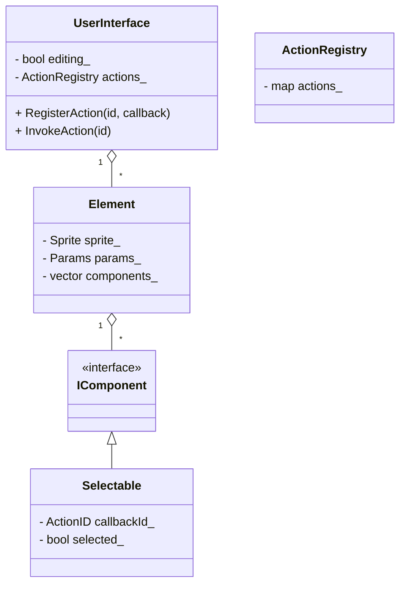

# UIシステム設計まとめ

## 方針の変遷

### 旧案
- UIRepos に `<名前, UI群>` を保持
- UIを一元管理する構成

### 新案（採用）
- **UserInterface クラスをUI単位のルートノードとして独立**
- 各使用箇所（PauseMenu, SkillTreeなど）がそれぞれ UserInterface を所有
- 一元管理は行わない（UIは局所管理）

---

## 問題意識

### Json管理の懸念
- ボタンやUI定義をJsonで管理した場合
- 「クリックされたときにどの関数が呼ばれるのか」が不明瞭
- 別クラスに存在する関数への直接参照は設計的に危険

---

## 設計判断

### Actionの責務分離
- **Selectableは関数そのものを持たない**
- 実際の関数（Callback）は UserInterface 側で管理
- UIごとに完全に独立した Action 空間を持つ

---

## クラス構成（概要）

### UserInterface
- UI単位のオーナー
- Action（Callback）を登録・実行する責務を持つ
- Jsonから読み込まれた callbackId と実関数を結びつける

### Element
- UIを構成する要素
- Sprite や Params を保持
- 複数の Component を持つ

### IComponent
- UI用コンポーネントの基底インターフェース

### Selectable
- 入力可能な要素を表す Component
- **持つものは最小限**
  - callbackId（コールバック識別子）
  - selected（選択状態）

---

## 現在のクラス図（mermaid）

---

## この設計のメリット

- UIごとの責務が明確
- PauseMenu と SkillTree で Action が混在しない
- Json管理とコード管理の境界が明確
- Selectable が肥大化しない
- 将来的な Component 拡張（Draggable / Scrollable 等）が容易

---

## 設計思想まとめ

- **UIは局所的に管理する**
- **Actionはオーナー（UserInterface）の責務**
- **Componentは状態と識別子のみを持つ**
